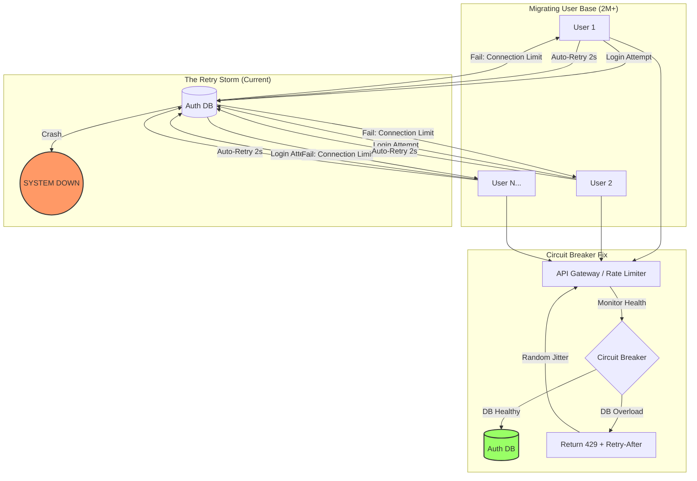

# Week 4: The Claude "Success Tax" Outage
### A Case Study in Retry Storms and Control Plane Saturation
**By Karthik Murali M**

**Abstract:**
On March 2, 2026, Anthropic’s Claude—the world's leading AI assistant—suffered a 10-hour global service degradation. This was not a failure of the AI models themselves (the "Data Plane"), but a collapse of the "Control Plane" (authentication and session management). This report analyzes how a massive user migration triggered a "Retry Storm" and "Database Saturation," proving that without proper backpressure and decoupling, even the most advanced systems can be paralyzed by their own success.

---

### I. The Anatomy of a "Success Tax"
In early 2026, following a major competitor's controversial policy shift, millions of users migrated to Claude simultaneously. This resulted in a **2,000% spike in authentication requests** within a 60-minute window. 

While Claude's GPU clusters (which run the actual AI) had plenty of capacity, the **Authentication Service**—the "front door" of the application—was not sharded for this level of load. The system hit a "Success Tax": the infrastructure was physically unable to process the sheer volume of users trying to log in at once.

### II. The Technical Root Cause: The "Retry Storm"
The failure began when the authentication database reached its connection limit. In a properly designed system, the application should tell the user to "Wait" (Backpressure). However, the client-side software was configured to **auto-retry** every time a login failed.

*   **The Feedback Loop:** If 1 million users fail to log in, and their browsers automatically retry every 2 seconds, you aren't dealing with 1 million requests—you're dealing with a **"Retry Storm"** of 30 million requests per minute. 
*   **Cascading Failure:** The authentication database exhausted its memory (OOM), which invalidated the session tokens for users who were *already* logged in. This forced "healthy" users out of the app, who then joined the login queue, further amplifying the storm.

### III. System Design Failure: Tight Coupling
The primary architectural flaw was the **tight coupling** between the Authentication Service and the Inference API. 
*   Because the API required a "Fresh Session Check" for every single chat message, the entire "Brain" of the AI became useless the moment the "Front Door" jammed. 
*   **The Design Fix:** Systems should implement **Graceful Degradation for Auth**. If the Auth Service is down but the user was recently verified, the system should allow "Stale" tokens for a limited time to keep the core service running while the DB recovers.

---

---

### IV. Prevention via Circuit Breakers and Backpressure
To prevent a repeat of the "Success Tax" disaster, the following design patterns are mandatory for 2026-scale apps:

1.  **Adaptive Rate Limiting:** The system should monitor its own DB health. If CPU hits 90%, it should return an `HTTP 429` (Too Many Requests) *with* a `Retry-After` header to tell the client exactly how long to wait.
2.  **Circuit Breaker Pattern:** Once a service (like Auth) starts failing, the "Circuit" should "Open." This stops all traffic to the failing DB immediately, allowing it time to clear its connection pool and recover, rather than being hammered into a permanent crash.
3.  **Jittered Retries:** Client-side retries must never be synchronized. Adding a random "Jitter" (e.g., waiting 2.4s instead of exactly 2s) breaks the "pulse" of the retry storm.

### V. Conclusion
The Claude outage of 2026 demonstrates that **Availability is a Design Choice.** High-scale systems must be architected with the assumption that every dependency will eventually fail. By decoupling the control plane from the data plane and implementing aggressive backpressure, engineers can ensure that a surge in popularity leads to a "Waiting Room" rather than a total system collapse.

---
